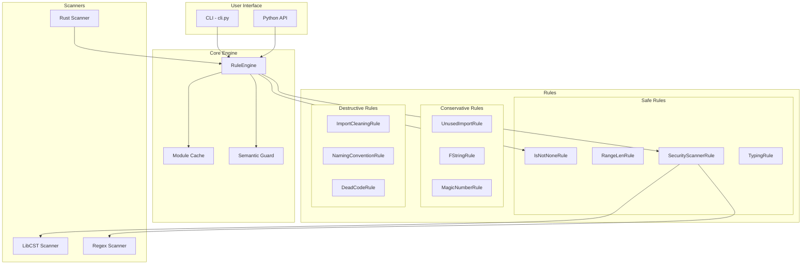
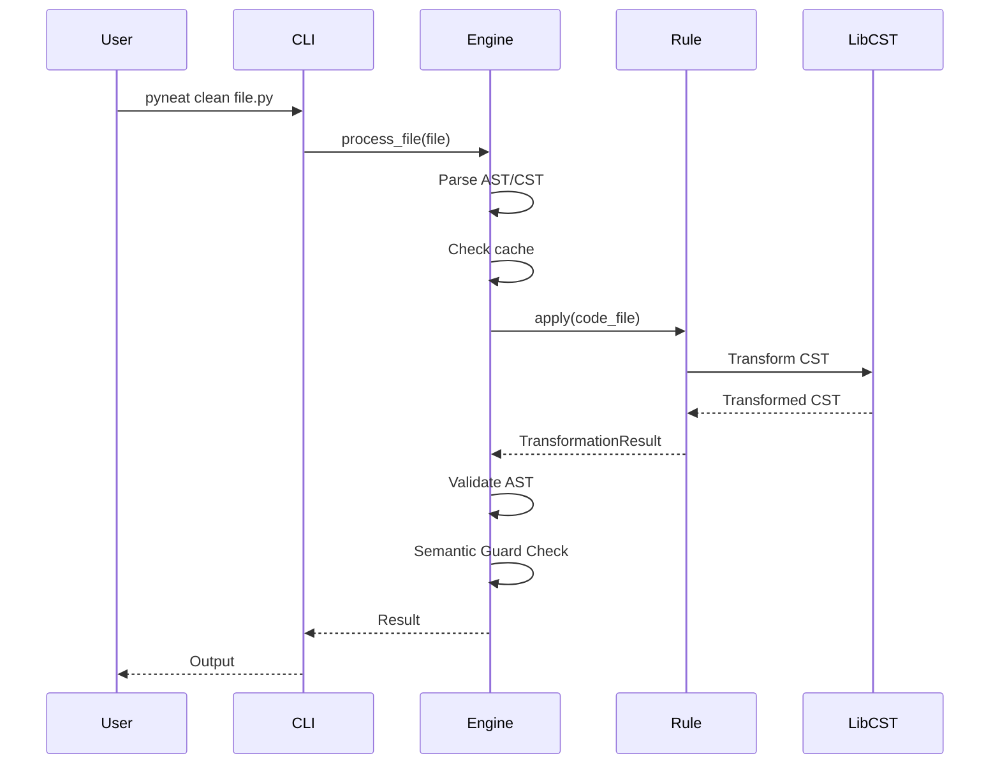
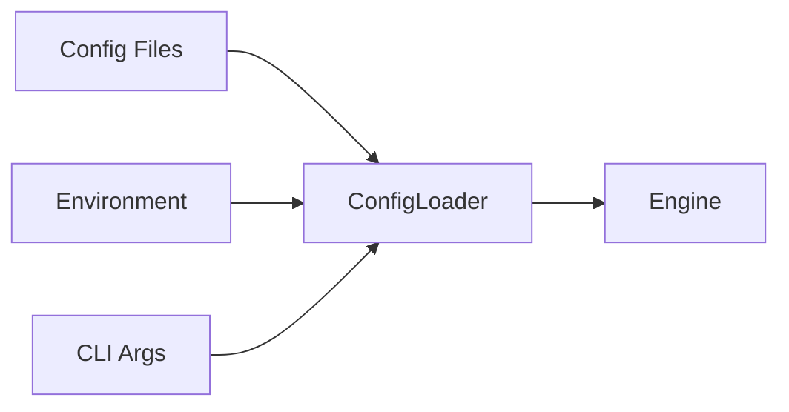

# Architecture

This document describes the architecture of PyNeat.

## Overview

PyNeat is an AI-Generated Code Scanner that detects and fixes common issues in AI-generated code. The architecture is designed to be modular, extensible, and performant.

## System Components



## Component Descriptions

### CLI (`pyneat/cli.py`)

The command-line interface provides user-facing commands:

- `pyneat clean <file>` - Clean a single file
- `pyneat check <target>` - Security scan
- `pyneat explain <rule_id>` - Explain a rule
- `pyneat report <target>` - Generate report

### RuleEngine (`pyneat/core/engine.py`)

The core orchestration engine:

1. Parses source code using LibCST
2. Runs rules in priority order
3. Validates output (AST compile check)
4. Detects conflicts between rules
5. Applies semantic guards

### Rules (`pyneat/rules/`)

Each rule is a standalone class that:

1. Implements `apply(CodeFile) -> TransformationResult`
2. Can read/write AST/CST nodes
3. Returns changes and security findings

### Security Scanner (`pyneat/rules/security/`)

Modular security scanner with:

- `python/scanners.py` - Python vulnerability scanners
- `php/scanners.py` - PHP vulnerability scanners
- 50+ security rules covering OWASP Top 10

## Data Flow



## Configuration System



## Extension Points

### Custom Rules

Create a custom rule by subclassing `Rule`:

```python
from pyneat.rules.base import Rule
from pyneat.core.types import CodeFile, TransformationResult

class MyCustomRule(Rule):
    @property
    def description(self) -> str:
        return "My custom rule"

    def apply(self, code_file: CodeFile) -> TransformationResult:
        # Detect and fix issues
        return self._create_result(original, transformed, changes)
```

### Plugins

Load plugins via entry points:

```toml
# pyproject.toml
[project.entry-points."pyneat.plugins"]
my-plugin = "my_package:MyPlugin"
```

### Rule Registry

Register rules with package and priority:

```python
from pyneat.rules.registry import RuleRegistry

@RuleRegistry.register(package="safe", priority=10)
class MyRule(Rule):
    ...
```

## Performance Optimizations

1. **Module-level Cache**: AST/CST trees cached across RuleEngine instances
2. **Rule Priority**: Safe rules run first, destructive rules last
3. **Conflict Detection**: Skip conflicting rules automatically
4. **Semantic Guards**: Validate AST before/after transformations

## Security Architecture

Security findings include:

- CWE/OWASP mapping
- CVSS scoring
- Fix guidance
- Auto-fix availability

```python
@dataclass(frozen=True)
class SecurityFinding:
    rule_id: str
    severity: str
    cwe_id: str
    owasp_id: str
    cvss_score: float
    auto_fix_available: bool
```
